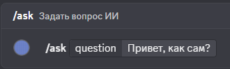
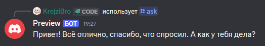

# Discord AI Bot

Прототип интеграции нейросетей (Groq API) в Discord бота.
Это минималистичный шаблон, который показывает как сделать быстрого и умного AI ассистента через слеш команды Discord.




## Возможности
* Слеш команды: взаимодействие происходит через нативную команду `/ask` в Discord.
* Быстрый API: используется Groq API для генерации ответов практически мгновенно.
* Асинхронность: запросы обрабатываются через `aiohttp` без блокировки цикла событий Discord бота.
* Обход лимитов Discord: если ответ нейросети превышает лимит в 2000 символов, бот автоматически отправит его в виде текстового `.txt` файла.

## Доступные модели (Groq API)
Вы можете легко поменять модель в коде (`bot.py`) на любую доступную в Groq. 
Некоторые из поддерживаемых моделей на данный момент:
* `openai/gpt-oss-20b` (установлена по умолчанию)
* `openai/gpt-oss-120b`
* `qwen/qwen3.8-27b`
* `allam-2-7b`
* `llama3-8b-8192`
* `llama3-70b-8192`
* `mixtral-8x7b-32768`
* `gemma2-9b-it`

## Установка

1. Установите зависимости:
```bash
pip install discord.py aiohttp
```

2. Укажите токены:
Откройте файл `bot.py` и вставьте свои ключи вместо заглушек:
* `DISCORD_TOKEN` ваш токен Discord бота (берется в Discord Developer Portal)
* `GROQ_API_KEY` ваш ключ от Groq API (берется в console.groq.com)

3. Запустите бота:
```bash
python bot.py
```

## Безопасность и промпты
Вы можете легко настроить характер бота, отредактировав переменную `SYSTEM_PROMPT` внутри кода.

В корневом каталоге также лежит файл `security_prompt.txt` как пример базовой защиты от джейлбрейков. 
Важно: Этот файл приведен чисто в ознакомительных целях. Любую текстовую защиту можно обойти, поэтому не полагайтесь на нее полностью. За то, что ИИ выдаст в чате, ответственность несете только вы. Используйте с умом.
